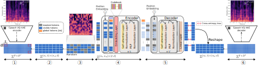

# A Vector Quantized Masked AutoEncoder for speech emotion recognition
[](https://github.com/samsad35/VQ-MAE-Speech-code)
[](https://www.python.org/)
[](https://samsad35.github.io/VQ-MAE-Speech/)
[](https://test.pypi.org/project/)





## Abstract
<center>

[Qualitative results](https://samsad35.github.io/VQ-MAE-Speech/#:~:text=as%20input%20representations.-,Qualitative%20Results,-Back) |  [Paper](https://samsad35.github.io/VQ-MAE-Speech/)

</center>

Recent years have seen remarkable progress in speech emotion recognition (SER), thanks to advances in deep learning techniques. However, the limited availability of labeled data remains a significant challenge in the field. Self-supervised learning has recently emerged as a promising solution to address this challenge. In this paper, we propose the vector quantized masked autoencoder for speech (VQ-MAE-S), a self-supervised model that is fine-tuned to recognize emotions from speech signals. The VQ-MAE-S model is based on a masked autoencoder (MAE) that operates in the discrete latent space of a vector quantized variational autoencoder. Experimental results show that the proposed VQ-MAE-S model, pre-trained on the VoxCeleb2 dataset and fine-tuned on emotional speech data, outperforms existing MAE methods that rely on speech spectrogram representations as input.


## Setup 
- [ ] Pypi: (Soon) 

[comment]: <> (  - ``````)
- [x] Install the package locally (for use on your system):  
  - In VQ-MAE-speech directoy: ```pip install -e .```
- [x] Virtual Environment: 
  - ```conda create -n vq_mae_s python=3.8```
  - ```conda activate vq_mae_s```
  - In VQ-MAE-speech directoy: ```pip install -r requirements.txt```

## Usage
* To do:
  * [x] Training Speech VQ-VAE
  * [X] Training VQ-MAE-Speech
  * [X] Fine-tuning and classification for emotion recognition
  * 
### 1) Training Speech VQ-VAE in unsupervised learning

```python
from vqmae import SpeechVQVAE, Speech_VQVAE_Train, VoxcelebSequential
import hydra
from omegaconf import DictConfig
import os


@hydra.main(config_path="config_vqvae", config_name="config")
def main(cfg: DictConfig):
    os.chdir(hydra.utils.get_original_cwd())
    """ Data """
    data_train = VoxcelebSequential(root=r"Path-to-data",
                                    h5_path=r"Path-to-H5",
                                    frames_per_clip=200,
                                    train=True
                                    )

    """ Model """
    vqvae = SpeechVQVAE(**cfg.model)
    # vqvae.load(path_model=r"checkpoint/VQVAE/2023-1-10/22-36/model_checkpoint")

    """ Training """
    pretrain_vqvae = Speech_VQVAE_Train(vqvae, data_train, data_train, config_training=cfg.train)
    # pretrain_vqvae.load(path=r"checkpoint/VQVAE/2022-12-28/12-7/model_checkpoint")
    pretrain_vqvae.fit()


if __name__ == '__main__':
    main()


```
- You can download our pre-trained speech VQ-VAE [following link]().

### 2) Training VQ-MAE-Speech in self-supervised learning
```python
from vqmae import MAE, MAE_Train, SpeechVQVAE, VoxcelebSequential
import hydra
from omegaconf import DictConfig
import os


@hydra.main(config_path="config_mae", config_name="config")
def main(cfg: DictConfig):
    os.chdir(hydra.utils.get_original_cwd())
    """ Data """
    data_train = VoxcelebSequential(root=r"Path-to-voxceleb2-train",
                                    h5_path=r"path-to-h5-train",
                                    frames_per_clip=200,
                                    train=True
                                    )

    data_validation = VoxcelebSequential(root=r"Path-to-voxceleb2-validation",
                                         h5_path=r"path-to-h5-validation",
                                         frames_per_clip=200
                                         )
    """ VQVAE """
    vqvae = SpeechVQVAE(**cfg.vqvae)
    vqvae.load(path_model=r"checkpoint/SPEECH_VQVAE/2022-12-27/21-42/model_checkpoint")

    """ MAE """
    mae = MAE(**cfg.model,
              vqvae_embedding=None,
              masking="random",
              trainable_position=True)  # ["random", "horizontal", "vertical", "mosaic"]

    """ Training """
    description = dict(encoder_depth=6, decoder_depth=4, ratio=0.50, masking="random", trainable_position=True)
    pretrain_vqvae = MAE_Train(mae,
                               vqvae,
                               data_train,
                               data_validation,
                               config_training=cfg.train,
                               tube_bool=True,
                               follow=True,
                               multigpu_bool=True,
                               description=description)
    # pretrain_vqvae.load(path="checkpoint/RSMAE/2023-2-1/11-4/model_checkpoint")
    pretrain_vqvae.fit()


if __name__ == '__main__':
    main()

```


## Pretrained models
| Model         	| Masking strategy    	| Masking ratio (%)                	|
|---------------	|---------------------	|------------------------	|
| VQ-MAE-Speech 	| Patch-based masking 	| [50]() - [60]() - [70]() - [80]() - [90]() 	|
| VQ-MAE-Speech 	| Frame-based masking 	| [50]() - [60]() - [70]() - [80]() - [90]() 	|

| Model         	| Encoder depth    	| 
|---------------	|---------------------	|
| VQ-MAE-Speech 	| [6]() - [12]() - [16]() - [20]() 	|

### 3) Fine-tuning and classification for emotion recognition

- (cross-validation | Speaker independent) Follow the file "[classification_speaker_independent.py]()".
- (80%/20% | Speaker dependent) Follow the file "[classification_speaker_dependent.py]()".

```

## License
GNU Affero General Public License (version 3), see LICENSE.txt.