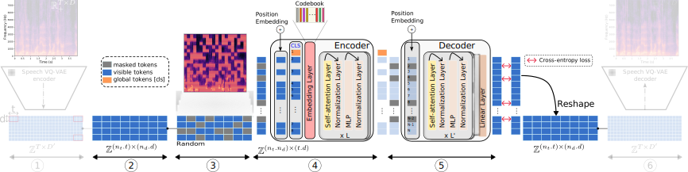

# A Vector Quantized Masked AutoEncoder for speech emotion recognition
[](https://github.com/samsad35/VQ-MAE-Speech-code)
[](https://www.python.org/)
[](https://samsad35.github.io/VQ-MAE-Speech/)
[](https://test.pypi.org/project/)


## Abstract
This repository contains the code associated with the following publication:
> **A vector quantized masked autoencoder for speech emotion recognition**<br> Samir Sadok, Simon Leglaive, Renaud Séguier<br>IEEE ICASSP 2023 Workshop on Self-Supervision in Audio, Speech and Beyond (SASB).

If you use this code for your research, please cite the above paper.

Useful links:
- [Abstract](https://arxiv.org/abs/2304.11117)
- [Paper](https://ieeexplore.ieee.org/document/10193151)
- [Demo website with qualitative results](https://samsad35.github.io/VQ-MAE-Speech/)

## Setup 
- [ ] Pypi: (Soon) 

[comment]: <> (  - ``````)
- [ ] Install the package locally (for use on your system):  
  - In VQ-MAE-speech directoy: ```pip install -e .```
- [x] Virtual Environment: 
  - ```conda create -n vq_mae_s python=3.8```
  - ```conda activate vq_mae_s```
  - In VQ-MAE-speech directoy: ```pip install -r requirements.txt```

## Usage
* To do:
  * [x] Training Speech VQ-VAE
  * [X] Training VQ-MAE-Speech
  * [X] Fine-tuning and classification for emotion recognition
  * [ ] Extension to audiovisual

### 1) Training Speech VQ-VAE in unsupervised learning


* Import model class (speechvqvae), learning data (VoxcelebSequential) and training data (Speech_VQVAE_Train)
* "config_vqvae" directory contains all model and training parameters VQ-VAE-Audio.
```python
from vqmae import SpeechVQVAE, Speech_VQVAE_Train, VoxcelebSequential
import hydra
from omegaconf import DictConfig
import os
```
```python
@hydra.main(config_path="config_vqvae", config_name="config")
def main(cfg: DictConfig):
    os.chdir(hydra.utils.get_original_cwd())
    """ Data """
    data_train = VoxcelebSequential(root=r"Path-to-data",
                                    h5_path=r"Path-to-H5",
                                    frames_per_clip=1,
                                    train=True
                                    )

    """ Model """
    vqvae = SpeechVQVAE(**cfg.model)

    """ Training """
    train_vqvae = Speech_VQVAE_Train(vqvae, data_train, data_train, config_training=cfg.train)
    # pretrain_vqvae.load(path=r"checkpoint/VQVAE/2022-12-28/12-7/model_checkpoint")
    train_vqvae.fit()


if __name__ == '__main__':
    main()
```

* **data_train**: You need to specify the path to the data as well as the path to the H5 file where the spectrograms are previously stored. 
* **vqvae**: The model must be initialized with the parameters in "config_vqvae".
* **train_vqvae**: Initiate the training class with model, data and parameters in "config_vqvae", then launch it with .fit().

- You can download our pre-trained speech VQ-VAE [following link]().

### 2) Training VQ-MAE-Speech in self-supervised learning


* Import model class (MAE and SpeechVQVAE), learning data (VoxcelebSequential) and training data (MAE_Train)
* "config_mae" directory contains all model and training parameters of VQ-MAE.

```python
from vqmae import MAE, MAE_Train, SpeechVQVAE, VoxcelebSequential
import hydra
from omegaconf import DictConfig
import os
```

* Initialize the training and validation data by specifying the respective path, as well as the path to H5 where the pre-processed data (audio -> spectrogram -> VQVAE -> discrete representation) is pre-calculated.
```python
@hydra.main(config_path="config_mae", config_name="config")
def main(cfg: DictConfig):
    os.chdir(hydra.utils.get_original_cwd())
    """ Data """
    data_train = VoxcelebSequential(root=r"Path-to-voxceleb2-train",
                                    h5_path=r"path-to-h5-train",
                                    frames_per_clip=200,
                                    train=True
                                    )

    data_validation = VoxcelebSequential(root=r"Path-to-voxceleb2-validation",
                                         h5_path=r"path-to-h5-validation",
                                         frames_per_clip=200
                                         )
```
* Initialize model configuration parameters in "config_mae.model", By choosing the type of masking ("random", "horizontal", "vertical", "mosaic") .
```python    
    """ VQVAE """
    vqvae = SpeechVQVAE(**cfg.vqvae)
    vqvae.load(path_model=r"checkpoint/SPEECH_VQVAE/2022-12-27/21-42/model_checkpoint")

    """ MAE """
    mae = MAE(**cfg.model,
              vqvae_embedding=None,
              masking="random",  # ["random", "horizontal", "vertical", "mosaic"]
              trainable_position=True) 
```
* Initialize training class parameters with training, validation, MAE and VQ-VAE model data, as well as configuration parameters in "config_mae.train".

_You can resume training from a backup by uncommenting the .load line._
```python
    """ Training """
    pretrain_vqvae = MAE_Train(mae,
                               vqvae,
                               data_train,
                               data_validation,
                               config_training=cfg.train,
                               tube_bool=True,
                               follow=True,
                               multigpu_bool=True
                               )
    # pretrain_vqvae.load(path="checkpoint/RSMAE/2023-2-1/11-4/model_checkpoint")
    pretrain_vqvae.fit()


if __name__ == '__main__':
    main()

```


## Pretrained models (released soon)
| Model         	| Masking strategy    	| Masking ratio (%)                	|
|---------------	|---------------------	|------------------------	|
| VQ-MAE-Speech 	| Patch-based masking 	| [50]() - [60]() - [70]() - [80]() - [90]() 	|
| VQ-MAE-Speech 	| Frame-based masking 	| [50]() - [60]() - [70]() - [80]() - [90]() 	|

| Model         	| Encoder depth    	| 
|---------------	|---------------------	|
| VQ-MAE-Speech 	| [6]() - [12]() - [16]() - [20]() 	|

### 3) Fine-tuning and classification for emotion recognition task

- (cross-validation | Speaker independent) Follow the file "[classification_speaker_independent.py]()".
- (80%/20% | Speaker dependent) Follow the file "[classification_speaker_dependent.py]()".

```

## License
GNU Affero General Public License (version 3), see LICENSE.txt.